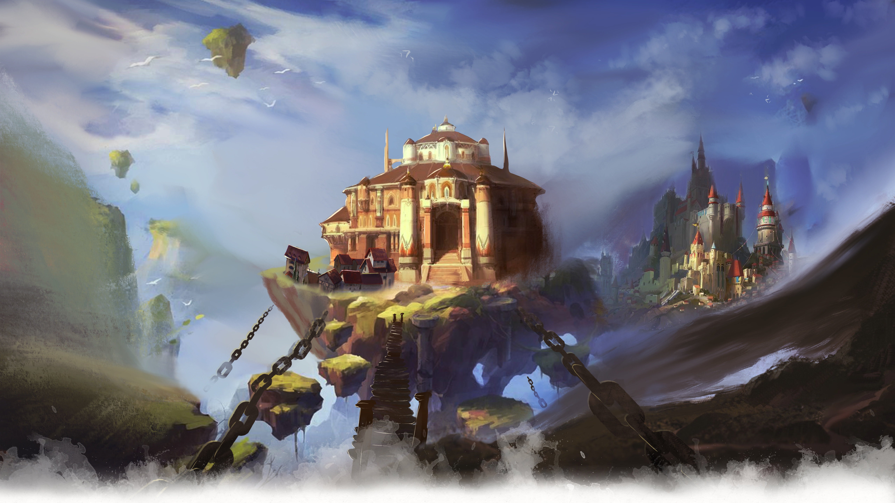
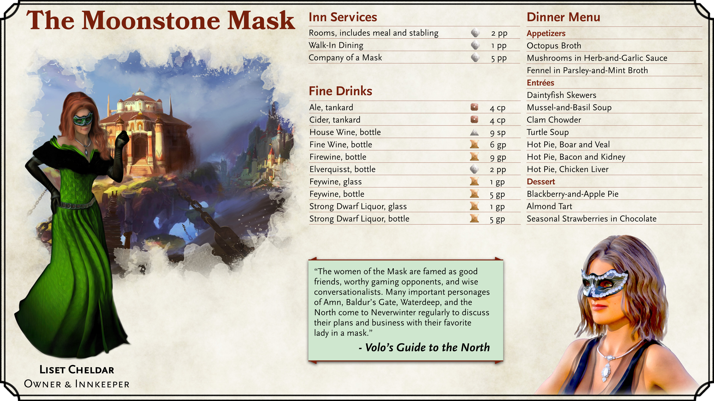
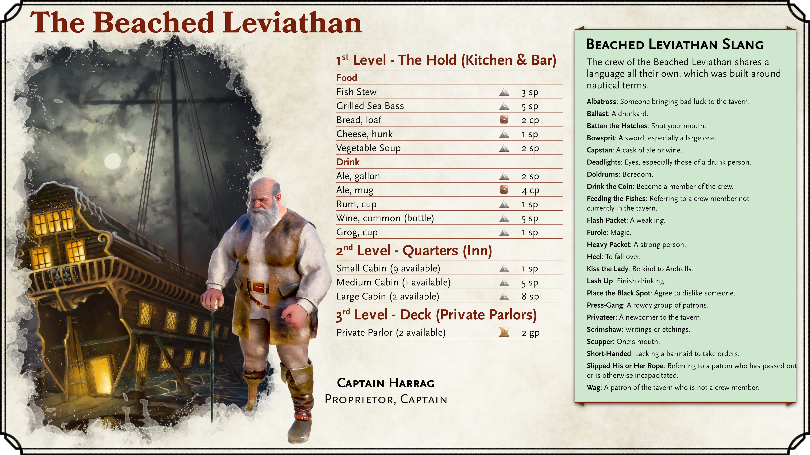
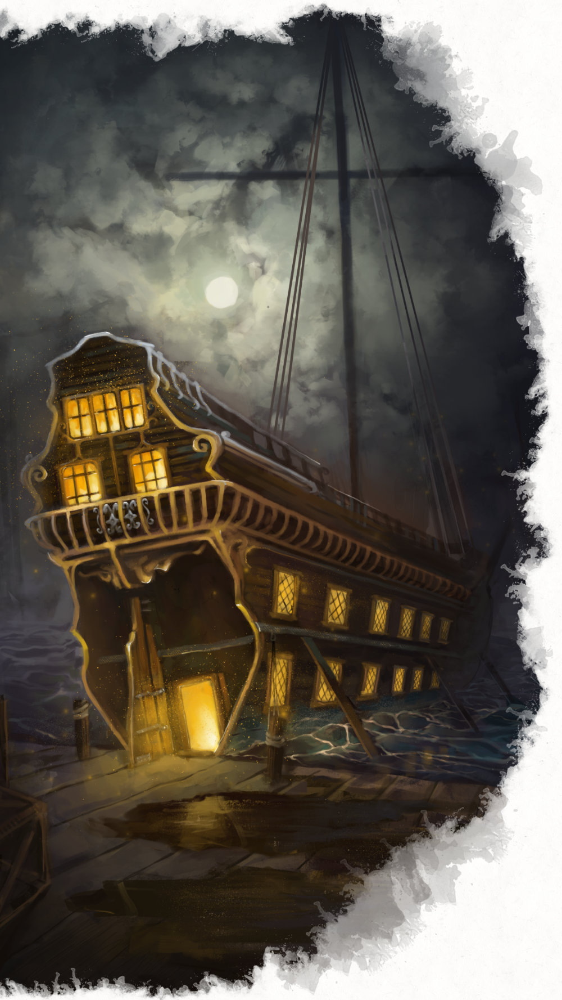
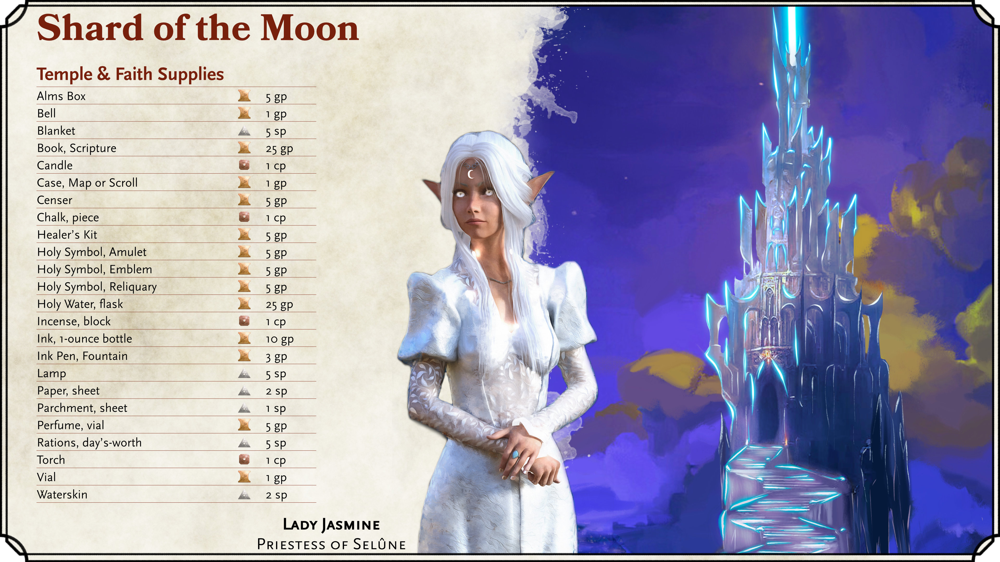
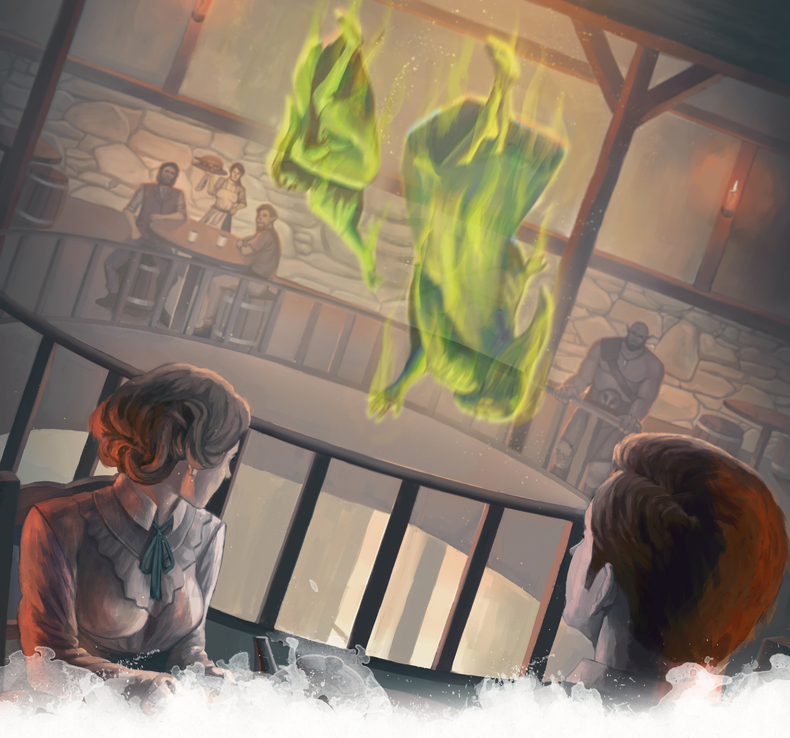
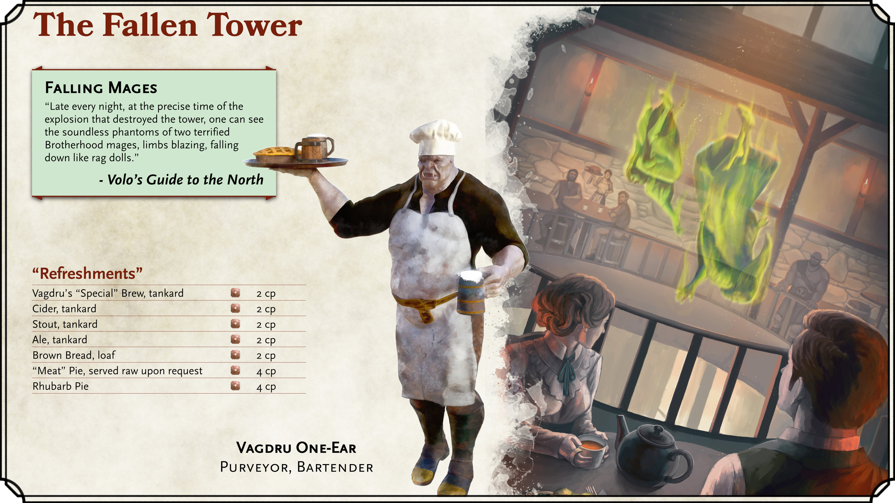

# Locations of Neverwinter

## Castle Never

{.print-only .print-bottom-right}

Castle Never, towering over the western end of the city, is impossible to miss. The castle sits on the rocky cliffs and outcroppings on the north side of the estuary where the Neverwinter River and the Sea of Swords meet. The castle has a circular rock around its main structure from which three bridges radiate out over the Neverwinter River: the Sleeping Dragon Bridge, the Winged Wyvern Bridge, and the Dolphin Bridge.

The castle straddles the boundaries between the Protectors Enclave, the Neverwinter Docks, and the Bluelake districts. Throughout history, Castle Never has been claimed as a part of many city districts, but it might be best to consider the Castle as its own district. The three bridges around the castle serve as an essential part of city infrastructure, providing a way of traversing the Neverwinter River and getting between the Protectors Enclave and Bluelake districts.

The castle's interior and exterior structure are both currently in disrepair, making the structure too dangerous for any inhabitation. The city's current de facto leader, Lord Dagult Neverember, is making inroads into restoring Castle Never.

#### Castle Never: Rise and Fall

A visitor to Neverwinter may note that its architecture differs a bit from that of other parts of the city. That is because Castle Never is actually over a millennium old, having been commissioned by the sun elf, Lord Halueth Never, who famously conquered the city of Illusk (of whose ruins modern-day Luskan now sits atop). Much of Castle Never was presumably built between -10 DR (Lord Never's conquest of Illusk) and 87 DR (the time Neverwinter was officially founded as a city). 

Throughout Neverwinter's many attacks and disasters, Castle Never has stood tall as an imposing symbol of the city's resolve as well as a monument to the city's former glories. That isn't to say, however, that the Castle has been left unscathed. Perhaps the most-significant disaster for Castle Never was in 1451 DR when "[the cataclysm](history-of-neverwinter)" struck Neverwinter and left most of Castle Never in ruins and killed almost all of its inhabitants (including the ruling lineage). Castle Never now remains haunted with the spirits of those killed in the cataclysm.

(print-page)

#### Inside the Castle

Exploring the interior of Castle Never is currently a perilous activity. Adventurers looking to navigate the castle would find it inhospitable due to both its ghostly inhabitants as well as the simple dangers of exploring a building so severely damaged. The Castle is a massive structure with countless stories that both ascend toward the sky and descend to the depths. It has has a number of well-documented areas of danger:
- ***The Atrium***. The atrium, now boarded over to keep sunlight out and the heat of rot inside, contains an eerie display of exotic bird skeletons in gilded cages. The atrium is now home to territorial [Myconids](/monster/myconid-adult) that will attack and feast on intruders.
- ***Hall of Mirrors***. Previously a long hall of mirrors where nobility practiced gait and posture, any mortal intruder that enters this hall will find a magical recreation of the hall's destruction. Shards of flying mirror glass and fiery ruins will be launched at any that dwell in the hall for too long.
- ***Neverneath***. The catacombs under the castle, referred to as the "Neverneath", feature an enchantment that cause the maze-like layout to change dynamically with a malevolent sentience. Structures will change to create dead ends, tunnels that lead back on themselves, or doors that lead to new locations each time they are opened. All of this serves to trap adventurers in until they meet their demise, likely at the claws of the catacomb's many [gargoyles](/monster/gargoyle).
- ***The Vault of the Nine***. This tomb is the resting place for the nine bodyguards of Neverwinter's royal lineage. The vault contains an outer chamber which features everburning torches that light the room when mortals enter. Undead lurk in the shadows of this outer chamber. The inner chamber, sealed away behind a giant stone door bearing the sigil of Neverwinter, has nine marble coffins that encircle a throne. Visitors that manage to make it to the inner chamber of the Vault of the Nine and take a rest may awaken to find the spirits the Nine standing vigil over them.

(print-column)

#### Restoring Castle Never

Lord Dagult Neverember has made it one of the city's priorities to see to the restoration of Castle Never. This is a tremendous undertaking that is likely to take years or decades. Neverember sees the endeavor as a worthwhile symbolic pursuit of the city's rejuvenation.

Grimly, one of the first portions of the castle that *has* been restored to functional use is its dungeons. Neverember has directed that those in Neverwinter convicted of high crimes be placed in castle dungeons, referred to as "The Holes" by the locals. Executions happen daily, at noon, in The Holes — generally two days from when the prisoner is sent to The Holes.

|**Dungeon Masters' Inspiration**|
|---|
|***Murderous Merchants***. The restoration of Castle Never has come at the cost of high taxation to the populace of Neverwinter. This has upset some powerful merchants with deep pockets and unsavory company. Lord Dagult Neverember knows assassination attempts are likely and tasks the party with his protection and removal of his would-be killers.|
|***Sentimental Relics***. A now-elderly Neverwinter noble lost a loved one in the castle's destruction nearly half a century ago. The elderly noble tasks the party with entry into the ruined castle to retrieve a sentimental relic from the body of their lost lover.|
|***Construction Blocked***. Crews overseeing the Castle's restoration know ghosts and other monsters will need to be cleared from the castle. Lord Neverember has hired warriors and mages to help with this. However, construction has stopped because the crew found a magical barrier they cannot get across. The party must investigate a way to get construction rolling again.|
{.dmidea}

|**Read More**|
|---|
|*Acquisitions Incorporated*, p. 121 - 122, (5th Edition)|
|*Sword Coast Adventurer's Guide*, p. 51, (5th Edition)|
|*Neverwinter Campaign Setting*, p. 148 - 149, (4th Edition)|
|*Grand History of the Realms*, p. 59, 61, (3rd Edition)|
|*The North - Guide to the Savage Frontier - Cities and Civilizations*, p. 16 (2nd Edition)|
|*Volo's Guide to the North*, p. 134 (2nd Edition)|
{.references}

(print-page)

## Protector's Enclave

### The Hall of Justice

The Hall of Justice stands as the primary temple to Tyr, the god of law and justice, in the city of Neverwinter. The Hall's grand stone walls, towering stone pillars, and high domed roof make it an impressive and intimidating structure. Its interior is also large enough to house large races such as giants and dragons.

Serving as much more than a mere temple to a deity, the Hall of Justice functioned as the city's court for low justice (i.e., excluding crimes where the accused were of noble birth, lacking citizenship, or charged with murder). It also served as a drilling and training ground in disciplined weaponry for those devout followers who served to defend the temple and that for which it stood. The Hall's functions largely ceased with Tyr's death in the late 1300s DR.

Even after Tyr's death, residents of Neverwinter refused to repurpose the temple to worship other deities. When Lord Neverember arrived in the city, he installed a temporary priesthood of Torm at the location, reasoning there were similarities in religious tenets. He also used the temple as a base for his operations in the city as well as a personal residence. Both actions were met with disapproval by the city's residents.

With Tyr's recent resurrection, the temple has now been rededicated to Tyr, and Lord Neverember now uses a private villa as his personal residence. The Hall's restoration was highly regarded by the citizens of Neverwinter and did much to improve Lord Neverember's esteem with locals. With the Hall of Justice returning to its former glory, it once again serves as the central focal point, in both physical location and spirit, of the Protector's Enclave.

|**Read More**|
|---|
|*Sword Coast Adventurer's Guide*, p. 51, (5th Edition)|
|*Neverwinter Campaign Setting*, p. 140 - 141, (4th Edition)|
|*Volo's Guide to the North*, p. 133 (2nd Edition)|
{.references}

### The House of Knowledge

The House of Knowledge is both a library and the primary temple to Oghma in the city of Neverwinter. Architecturally, it is regarded as one of the most impressive and beautiful structures in the city. Its vast libraries contain many centuries worth of precious records and materials, including modern government documentation as the city lacks a formal seat of government at present.

Like so much of Neverwinter, the House of Knowledge suffered near total destruction with the eruption of Mount Hotenow in 1451 DR. A dedicated young Loremaster, Atlavast, saved much of the library's precious contents by sealing away the temple's inner sanctum and trapping himself inside. Alone and in solitude, Atlavast managed to survive the cataclysm and save multitudes of rare tomes, documents, and artifacts. However, he soon grew reclusive and a little mad from the isolation. He spent his time repeatedly cataloging and reorganizing the library. He grew extremely protective of the content. During this time, the outer sections of the House of Knowledge were taken over by various squatters, including the devil-worshipping Ashmadai cultists.

Since the chasm's sealing, the faithful of Oghma have returned to the temple and work to restore it as a center of knowledge and learning. The stern Grand Scribe Spivey Liethennson now oversees the House's reconstruction with an iron fist and short temper. The House of Knowledge's exterior has already been largely restored, though much restoration work remains underway on the interior. Still, the house has once again become a functional location for those seeking local lore and records.

|**Dungeon Masters' Inspiration**|
|---|
|***Inconvenient Information***. Players seeking specific lore about Neverwinter or the surrounding area would be wise to consider the vast wealth of information stored at the House of Knowledge. However, to access some pieces of knowledge, the party might have to contend with the short fuse of Grand Scribe Liethennson or the cracked, over-protective demeanor of Loremaster Atlavast. Either may make the party prove themselves in some way before they would be trusted with the library's contents.|
{.dmidea}

|**Read More**|
|---|
|*Sword Coast Adventurer's Guide*, p. 51, (5th Edition)|
|*Acquisitions Incorporated*, p. 122, (5th Edition)|
|*Neverwinter Campaign Setting*, p. 144 - 145, (4th Edition)|
|*The North - Guide to the Savage Frontier - Cities and Civilizations*, p. 16 (2nd Edition)|
{.references}

(print-page)

{.size-cover .no-margin .print-only}

## The Floating Earthmotes

One of the most enchanting features of the city of Neverwinter is its three large floating earthmotes. The Spellplague of 1385 DR caused chunks of Neverwinter (as well as other areas all over Toril) to rise up and begin floating away. Industrious residents of Neverwinter were able to tether a few of these earthmotes with ropes and prevent them from ultimately flying off into the Sword Coast.

{.size-full .screen-only .before-next-page-header}

### The Moonstone Mask

The Moonstone Mask is a large inn that sits on a floating earthmote connected to the docks of the Protector's Enclave section of Neverwinter. It is regarded by many as Neverwinter's finest, most luxurious inn. The locale is named for the half-masks worn by all of its staff, which are lined with glowing moonstones.

(print-column)

#### The Mask's Staff

One might assume the Moonstone Mask's impeccable accommodations and unparalleled views are what entices its patrons, but it is actually the Mask's staff that are the inn's primary draw. The serving staff are all trained to be expertly-skilled companions as well as friendly and loyal confidants. The staff can be expected to offer erudite conversation and skill in a variety of games. It is this companionship that has made the Moonstone Mask a destination for the people of high rank and wealth for over a century. 

{.print-bottom-right .with-margin}

(print-page)

While the Moonstone Mask no longer employs only women as its serving staff, all of the customer-facing employees are exceptionally attractive. The Moonstone Mask's staff are all dressed in sheer black, each also wearing the inn's namesake masks and an amulet. However, these clothing items are no simple uniform. The masks provide the wearer with the abilities of Dark Vision or Infravision, allowing all of the staff to gracefully traverse dim or darkened areas of the inn. The amulets, also magical, provide the staff immunity from mind-reading or control — an important quality given how much sensitive information the inn's companions are entrusted with. The amulets also allow magical communication with the inn's proprietor using only silent-thought — an important security feature were an employee to ever encounter an unruly or unsavory guest.

Liset Cheldar, a half-elf woman, currently serves as the Moonstone Masks' proprietor. Liset is presumed to be the descendant of the Moonstone Masks' previous owner, Ophala Cheldarstorn. Unlike Ophala, who was a powerful mage, Liset does not appear to possess such powers. Liset is friendly and known to flirt with guests.

#### The Mask's Amenities

The inn features a large, warm, and inviting ground floor dining room. The room also serves as a comfortable lounge with an impressive hearth. The rest of the first floor is taken up by kitchens dedicated to preparing haute cuisine for the inn's many guests. A grand, spiraling staircase leads up from the dining room to the guest rooms above. The atmosphere of the dining room is generally relaxed with polite conversations occurring throughout.

Guest rooms occupy the second through fourth floors. The rooms range in size from single-bed studios to large suites on the upper floors. All feature comfortable beds and luscious fur rugs. Guests staying in the inn's rooms can expect meals to be included with the price of their stay, but alcohol can cost extra. Naturally, the Mask features an impressive selection of fine libations.

For guests travelling through the most elaborate means, the roof features a special landing for winged steeds. It is rumored the Mask is laden with hidden wall panels that can open up for secretive travel within the inn itself. The staff is said to open these panels by speaking certain magical words. The fifth floor, directly below the penthouse suites, houses a lively festhall with music and dancing. The aforementioned magical soundproofing ensures this doesn't disturb any of the guests.

(print-column)

|**Dungeon Masters' Inspiration**|
|---|
|***Knowledge Base***. Liset and the other Moonstone Mask staff would possess a wealth of information and rumors about the city. They'd never offer up confidential information about one of their clients, but they would be able to inform adventurers about non-confidential events and rumors.|
|***Good Company***. It wouldn't be uncommon or surprising to find notable figures at the Moonstone Mask, including Lord Dagult Neverember himself. Use this location as a place for notable run-ins.|
|***Baubles in the Basement***. If players were able to creep around the various storage rooms in the Mask's basement without getting caught, they may find all manner of magical items.|
{.dmidea}

(print-page)

#### The Mask's History

The Moonstone Mask was built by Ophala Cheldarstorn, a mage and member of the Many-Starred Cloak. Ophala is also the creator of the magical masks and amulets worn by the staff. Before the Mask was sent floating above Neverwinter, it was rumored to feature secret entrances where special guests could enter and depart unnoticed. It was also rumored to have basements that connected to tunnels to dwarven-held areas of the Underdark.

In the mid-1400s DR, the inn drifted into the Sea of Swords after the eruption of Mount Hotenow snapped the inn's rope tethers.  The ropes tethering the inn were eventually replaced by large, sturdy chains, but only after the inn went drifting over the Sea of Swords for months. Even after the Mask was finally returned to Neverwinter, it ultimately attracted too few guests, became insolvent, and shuttered for a few decades. After Lord Dagult Neverember started his "New Neverwinter" movement to begin rebuilding Neverwinter, Liset Cheldar was able to not only convince Neverember that she was the rightful heir of the Moonstone Mask, but also able to have him help fund the restoration of the inn to much of its former glory under Ophala Cheldarstorn. In repayment the inn served to often house Neverember and many of his mercenaries and officers throughout the 1470s and 1480s DR.

|**Read More**|
|---|
|*Neverwinter Campaign Setting*, p. 142 - 143, (4th Edition)|
|*Storm Over Neverwinter*, p. 9 - 10 (4th Edition)|
|*Volo's Guide to the North*, p. 138 - 140 (2nd Edition)|
|*The North - Guide to the Savage Frontier - Cities and Civilizations*, p. 16 - 17 (2nd Edition)|
{.references}

### Pirates' Skyhold

Northwest of Neverwinter, just off the Sword Coast, is another floating earthmote referred to as "Pirates' Skyhold". Soon after the Spellplague, some pirates in the area noted the earthmote could serve as a defensible base in the coasts they roamed. One band of pirates, in possession of a skyship, claimed the earthmote as their own and built up modest wooden fortifications on the earthmote.

A mysterious tragedy befell the skyhold that left most, if not all, of its pirate residents dead or missing. Their skyship remains docked on the earthmote as an eerie reminder of its abandonment. No one knows precisely what happened on the skyhold, but scores of rumors about the location circulate in Neverwinter. Some claim a dragon took the skyhold, others claim it is being inhabited by Netherese, while still others claim it is haunted by all manner of ghosts.

It is also rumored that a hoard of treasure still exists on the earthmote. The pirates were reported to store their booty in the skyhold, and given their sudden demise, it is thought the treasure must surely still be on the earthmote somewhere. Getting to the skyhold, however, is no easy feat. Some form of aerial or magical transportation will need to be procured to access the area.

|**Dungeon Masters' Inspiration**|
|---|
|***An Open Book***. Per the Neverwinter Campaign Setting of Fourth Edition, the Pirate's Skyhold was intentionally left mysterious and open for Dungeon Masters to create their own adventures at the location.|
|***Dragon's Hoard***. It's well-known dragons love a good hoard! A younger dragon may have attacked the Skyhold, slain all the inhabitants, and kept the pirates' booty as its very own hoard.|
|***Zombie Pirates***. The god of death, Myrkul, has been very active in the area (see [Dragon of Icespire Peak](https://www.dndbeyond.com/sources/doip) and the [Beyond Dragon of Icespire Peak](https://www.dndbeyond.com/essentials/continue-the-adventure) trilogy). Undead have overrun the Skyhold and turned it into a fort of the damned. The Death Knight-Dreadnaught is eerily anchored below the earthmote.|
|***I'll Take One of Each***. Myrkul has sent a [Dracolich](/monster/adult-blue-dracolich){.red} or [Ghost Dragon](/monster/ghost-dragon){.red} to the Skyhold, where it sits on a hoard of pirate booty and lords over an army of undead pirates!|
{.dmidea}

|**Read More**|
|---|
|1 - *Neverwinter Campaign Setting*, p. 148, (4th Edition)|
{.references}

### Fisher's Float

Fisher's Float is an earthmote just southwest of Neverwinter that a hearty guild of fishermen have made their home and business headquarters. The homes and warehouses visible on the earthmote are austere by all accounts. The small, wooden shanties certainly imply that the fishers and sailors that call the Float their home are not living indulgent lifestyles.

While these fishermen peacefully supply a massive portion of Neverwinter's seafood, they also manage to keep largely to themselves. As a result, there exist plenty of rumors about the goings-on of Fisher's Float. One particularly prevalent rumor is that the residents of Fisher's Float are in some form of allegiance with evil sea gods and/or sea monsters.

|**Read More**|
|---|
|*Neverwinter Campaign Setting*, p. 148, (4th Edition)|
{.references}

(print-page-single-column)

## Neverwinter's Docks

{.size-full .screen-only .before-next-page-header}

### The Beached Leviathan

The Leviathan was an infamous pirate vessel that prowled up and down the Sword Coast, striking terror into those that crossed its path. The Leviathan's captain, Harrag, was a fearsome foe to any that met him at sea, and no sailors felt their treasure safe while Harrag was out hunting on the Sea of Swords. Sometime after the eruption of Mount Hotenow, the Leviathan ran aground in northern Neverwinter and punctured its hull. Rather than abandon his ship, Harrag stayed with it as the city's docks were rebuilt around the ship (part of the general reconstruction efforts of the time). Harrag oversaw the ship's conversion from a wreck into a thriving inn and tavern.

{.image-beached-leviathan}

#### Walking the Planks

The ship is divided into three levels for guests. The first level ("the hold"), entered from the docks, hosts the Beached Leviathan's kitchen and tavern. The tavern has a large number of tables fit for parties of all sizes. The second level ("the quarters") hosts an inn with 12 rooms of various sizes for rent, and the third level ("the deck") features private parlor rooms and tables that can be rented for a heftier price. Atop "the deck" is an extra upper cabin that serves as Captain Harrag's private quarters. The decks' various levels are accessible via a small spiral staircase at the center of the ship. In addition, a pulley-operated lift can transport goods between each of the levels via a small shaft that extends through each of the levels.

The entire ship is decorated with nautically-themed paraphernalia, many of which are trophies from Harrag's past conquests. The interior of the ship and its furnishing are well-crafted, featuring fancy oak and cherry woodwork. However, years of patrons coming, going, and brawling have left the finely-crafted interior well-worn.

#### Grog and Gangs

The clientele of the Beached Leviathan are generally a humble, mixed bunch. Any with coin to spend are welcome at the tavern. Frequent patrons include sailors as well as more land-bound residents of Neverwinter. Both staff and patrons frequently use nautical slang in the tavern (e.g., referring to a drunkard as "ballast" or calling a newcomer a "privateer"). It's very common for landlubbing visitors to feel a bit lost when it comes to parsing the sailors' dialect. Gambling and brawling are both frequent occurrences, though the latter is likely to get you promptly tossed off the ship.

It's also extremely common to find any number of seedy factions represented at the Beached Leviathan. Commonly sighted at the tavern are smugglers, thieves, and press gangs. To these ilk, the Beached Leviathan serves as an important place of business. Deals are made, trades are performed, and the occasional drunken sailor is enslaved. All of this is relatively well-known to Lord Neverember and his forces, who often also discretely monitor the tavern to keep abreast of the city's seedy underbelly. Neverember and his watch, however, almost never intercede in these foul dealings, choosing instead to keep the tavern as a reliable source of information.

(print-page)

#### Loyal Shipmates

An establishment like the Beached Leviathan couldn't exist without a fearless captain and a hearty crew to support him. The Beached Leviathan has a colorful collection of staff and regulars that make the location such an interesting place. Becoming a regular at the tavern is likely to earn one an apt, nautically-themed nickname.

***Captain Harrag.*** Captain Harrag is a burly, hairy man with only one leg (he lost the other in a fight with sahuagin). He has a fearsome and gruff exterior, but those who know him closest are aware that the man possesses an impressive amount of compassion and empathy. The Beached Leviathan is a true labor of love for the Captain, and he takes immense pride in the establishment. That said, Harrag is no pushover. Harrag will not shy away from securing good deals for his business even if the tactics demand he be cutthroat. Likewise, those that threaten the establishment will be swiftly and strongly dealt with.

##### Staff ("Crew")

***Andrella.*** "Mate" - Andrella is Harrag's right hand. A middle-aged, human woman, she is the lead barmaid (Jyseria, Sandrine, and Willow being the other barmaids). She leads the staff when Harrag isn't around and cares very deeply for Harrag. She has developed somewhat of a secret, unrequited love for the Captain.

***Feng.*** A very large half-orc male, Feng serves as the tavern's bouncer.

***Tabnab.*** An oddball human male, Tabnab is the inn's cook.

##### Regulars

***Len-jes.*** "Harbomaster" - Len-jes, a female scarred watersoul genasi, is actually the harbormaster of Neverwinter. She rents a room in the Beached Leviathan semiregularly.

***Umi.*** "Helmswoman" - Umi, also a female watersoul genasi, is Len-jes's cousin and serves as backup to Feng if a situation at the tavern becomes too rowdy. She's highly skilled with the sword.

***Bobrik Highmantle.*** "Bosun" - Bobrik, a stout male dwarf with a pet monkey, is a regular fixture at the bar. He has a fiery temper that occasionally gets him kicked out of the tavern for a few days. 

***Markul.*** "Lookout" - Markul, a young human man, is constantly listening to all the goings-on at the tavern. For the right price, he's willing to share the secrets he has learned, as long as they aren't secrets that he perceives would harm the Leviathan.

***Ettain.*** "Caulker" - Ettain, a half-elf male, works as the ship's handyman. He's a skilled carpenter that can repair the ship as well as craft or repair its furniture when needed. He knows every square inch of the ship, including its secrets.

***Korin.*** "Chanteyman" - Korin, a middle-aged male dragonborn bard, plays music and sings at the tavern. He is often known to get the whole bar singing sea shanties and folk songs. He gladly accepts tips and drinks. His family was slaughtered by cultists, which he will sometimes work into a sorrow-laden dirge.

(print-page)

#### Stormy Waters

Throughout its relatively brief history in Neverwinter, the Beached Leviathan has found itself embroiled in conflict well beyond its seemingly-humble station. This is largely because of the type of patronage allowed in the Leviathan, in addition to Lord Neverember's own involvement with the locale. It was with Neverember's support and patronage that Harrag was able to create the establishment at all — as Neverember was ultimately the one to expunge record of his numerous crimes on the high seas. This made Harrag a true Neverember loyalist. Lord Neverember absolutely uses Harrag for his own ambitions. Neverember even went so far as to turn Harrag's own shadow into a sentient creature used to spy on the facility. 

In 1479, as part of the scuffle over the true heir to the throne of Neverwinter and the lost crown of Alagondar, the Leviathan was attacked by furious Neverwinter members. The Leviathan was only saved because of intervention from adventurers and Neverember’s top general, General Sabine. Later, that same year, Ashmadai cultists and demons infiltrated the the Beached Leviathan and killed one of General Sabine's top advisors. This was ultimately part of a larger plot by a powerful mage named Elden Vargas to use the powers of Asmodeus to his own purposes. 

|**Read More**|
|---|
|*Dungeon*, Issue #193, p. 79 -83, (4th Edition)|
|*Neverwinter Campaign Setting*, p. 154-155, (4th Edition)|
|*Lost Crown of Neverwinter*, p. 18 - 19, (4th Edition)|
|*Storm Over Neverwinter*, p. 17 - 18, (4th Edition)|
{.references}

### The Driftwood Tavern

Almost more of a museum than a tavern, the upscale and expensive Driftwood Tavern sits in the northern docks area of Neverwinter. The tavern is one of Neverwinter's older drinking locales — having been in operation since before the Spellplague of 1385 DR. After the cataclysm of 1451 DR, the tavern was used to shelter refugees and served as a makeshift city hall while the city regained some semblance of normalcy.

The establishment is chock-full of bric-a-brac. Rather than viewing the establishment as cluttered or disorganized, however, many view it as a beautiful tribute to "Old Neverwinter" and a vital part of preserving the city's history. Indeed, many travelers visit the tavern and pay its high prices for drinks and/or lodging simply to enjoy the relics collected at the establishment.

Madame Rosene, now roughly 70 years old, runs the establishment. In 1479 DR, she was secretly the leader of the Sons of Alagondar (i.e., the Graycloaks), a rebel group that opposed Lord Neverember's rule in the city. The faction, now, has largely made peace with Neverember's rule, many members even enlisting in Neverwinter's army (feeling it better that they control their own army rather than continuing to let Mintarn mercenaries have power in the city). Madame Rosene is a fount of knowledge regarding the city's history and will happily chat about old times with patrons.

|**Read More**|
|---|
|*Sword Coast Adventurer's Guide*, p. 52, (5th Edition)|
|*Neverwinter Campaign Setting*, p. 154-155, (4th Edition)|
{.references}

### The Tarmalune Trade House

A trade cartel from the city of Tarmalune has procured a large warehouse complex on the southern docks of Neverwinter. Outside of the docks, a large swath of stalls and booths have been set up with goods for sale. The Tarmalune merchants are trying desperately to establish a solid trade presence in the area, largely to counter their rival traders from the city of Lylorn that have recently established a trade route in nearby Luskan.

|**Dungeon Masters' Inspiration**|
|---|
|***No Free Two-Day Shipping***. If your players need something very specific and hard-to-acquire, it would be somewhat reasonable that the Tarmalune's large trade network might be able to procure the item. However, it would *also* be entirely reasonable to expect this favor to come at a high price and to take some time. After all, it takes a long time, a lot of resources, and a lot of risk to sail such a distance in Toril.|
{.dmidea}

|**Read More**|
|---|
|*Neverwinter Campaign Setting*, p. 147, (4th Edition)|
{.references}

(print-page)

{.print-only .print-top-left}

(print-column)

## Tower District

{.size-full .screen-only .before-next-page-header}

### The Shard of the Moon

The Shard of the Moon, formerly called "The Shard of Night", is a floating tower in the Tower District of Neverwinter. The tower has had a storied journey through both the Material Plane and Plane of Shadow.

The tower began its existence as Moonshadow Hall, over a thousand miles away from Neverwinter, in the city of Yhaunn. In the late 14th century DR, the Shadovar (dwellers of Shadowfell and one of the few remaining factions of Netherese) assaulted the temple and magically tore away one of its towers and sent it to Shadowfell. The Shadovar learned they were able to manifest the tower at arbitrary locations in the mortal realms, and thus placed it strategically floating over Neverwinter during the Spellplague. The Netherese could use a portal in the tower to transport between Xinlenal and Neverwinter. 

The tower was darkened black and cast no shadow in the day. This was actually because the temple was magically manipulated to absorb shadow. This shadow, in turn, powered the tower's teleportation devices. The ominous, forboding tower looming overhead was largely avoided by all in Neverwinter as any who ventured inside would never return.

{.print-bottom-right}

(print-page)

In 1479 DR, adventurers raided the tower and allowed the the priests of Selûne to return to the tower and perform a purification, restoring the tower to its alabaster white appearance. Now, at night when three magical shards are placed within, or below, the floating tower, a stairway of solid moonlight descends from the tower entrance. The priests of Selûne will allow only trusted visitors entrance into the tower. Those particularly-trusted visitors that take a long rest in the tower find that they receive an extra healing surge until they next take a long rest.

|**Read More**|
|---|
|*Dungeon*, Issue #193, p. 57 - 78, (4th Edition)|
|*Neverwinter Campaign Setting*, p. 158, (4th Edition)|
{.references}

### The Cloak Tower

The Cloak Tower was a wizard tower that served as a meeting place and citadel to the Many-Starred Cloak order of wizards. However, currently, it is occupied by the Many-Arrows tribe of orcs.

#### Vanishing Fortifications

The Cloak Tower, and all of the wizards within, disappeared during the Spellplague in 1385 DR. The tower mysteriously returned about six months later — albeit in a new location. However, there were no traces of the wizards that had once resided there. 

Naturally, once the tower returned to Neverwinter, it didn't take long for thieves to attempt looting the tower. The tower, after all, was thought to contain a wondrous magical device found in a Netherese ruin called "Halavar's Universal Pantograph". The device could reportedly duplicate metal objects that were "the size of a large throne or smaller" — this included coins! However, all the thieves soon perished in the tower, leaving a sole survivor to recount the tales of what was seen.

The thieves didn't locate the magical device, and they saw neither wizards nor their bodies. The colorful cloaks mysteriously remained, however, hanging on the pegs where they were left. Suddenly, the colorful cloaks came to life and smothered the thieves to death, save the sole survivor.

#### Orc Infestation

The Many-Arrows orc tribe invaded the tower and were able to claim it. The Neverwinter residents, assuming the tower was warded by some leftover magical defenses left by the Many-Starred Cloak wizards, thought the orcs too would soon perish in the tower. The orcs, however, seemingly did not meet any resistance in the tower and were able to hold it.

Lord Neverember tolerates the orcs in the location largely because he has no better option. The tower, itself, is actually one of the most fortified locations in the city. Currently without a clear path to do so, Lord Neverember is biding his time until he can figure out how to remove the orcs from the city.

|**Read More**|
|---|
|*Neverwinter Campaign Setting*, p. 120, 157 (4th Edition)|
|*Volo's Guide to the North*, p. 134 (2nd Edition)|
{.references}

{.print-bottom-right .with-margin}

(print-page)

{.size-cover .no-margin .before-next-page-header .print-only}

{.size-full .screen-only .before-next-page-header}

### The Fallen Tower

The Fallen Tower is a tavern constructed in the ruins of a wizard's tower. The tavern features a rather unique and macabre nightly spectacle that has kept it a popular drinking location for well over a century.

#### The Tower's History

Decades before the Spellplague, the tower was owned by a powerful wizard named Llomnauvel "Firehands" Oloadhin. The Arcane Brotherhood coveted Oloadhin's accumulation of magical items. One night, the Brotherhood violently attacked the tower in an attempt to steal the magical goods and capture Oloadhin. A spectacular magical battle raged throughout the tower. Oloadhin had anticipated the attack and rigged his tower with all manner of magical traps, including maniacal spells that turned the trespassers into lowly sea creatures. However, Oloadhin's traps were ultimately unable to stop the raid. Rather than let the Arcane Brotherhood take his tower and the contents within, the unhinged Oloadhin triggered a final massive spell that destroyed the tower. As the tower fell in a magical blaze, everyone inside perished (including Oloadhin himself).

(print-page)

#### The Nightly Show

Phantasmic remnants of the tower's destruction remain at the location. Every night, at the exact time Llomnauvel triggered the explosion that destroyed the tower, visions of those final moments appear at the ruined base of the tower. These silent magical projections depict Brotherhood mages, ablaze, falling helplessly to their deaths. This is soon followed by the Brotherhood's Overwizard falling similarly while his limbs transform into eels.

This seemingly harmless magical vision both horrified and fascinated onlookers. Naturally, some entrepreneurial individuals managed to turn this tragic spectacle into entertainment for locals and travelers alike. The base of the tower was renovated into a tavern. The area of the spectacle was railed off, and tables were placed all around it so that patrons may watch the "show" as they sipped on their drinks. Sadly, the tavern eventually gained a reputation for mediocre, overpriced drinks and a steep cover charge. That, combined with the multiple catastrophes that hit Neverwinter in the 15th century DR, eventually left the tavern abandoned.

{.print-bottom-left .with-margin}

(print-column)

#### Under New Management

The Many-Arrow tribe discovered and started to loot the tavern and its vast wine stores when they invaded Neverwinter's Tower District. One night, in the midst of their looting and revelry at the Fallen Tower, the phantasmic images appeared and scared the orcs out of the building. The orcs eventually mustered their courage and, once realizing the phantom images were harmless, returned to the building.

An enterprising single-eared orc named "Vagdru One-Ear" restored the site to being a functioning tavern. By way of a mutual agreement between Lord Neverember and the leadership of the Many-Arrow tribe, the tavern now serves as a neutral ground between the orcs and other races that occupy the city. All are welcome to enjoy the tavern's offerings provided they start no trouble. Any troublemakers that violate this truce are likely to face the immediate wrath of the tavern's regular clientele. The tavern's current offerings, however, are "humble" and priced accordingly. The wine and ale are inexpensive but satisfactory. Raw meat, of an unknown source, is served up to be prepared over an open cook fire.

|**Dungeon Masters' Inspiration**|
|---|
|***Technical Difficulties***. Something goes wrong, and the previously-benign nightly magical visions of the falling mages become real; the flames of the falling mages scorch patrons. Adventurers must contain the Fallen Towers magic lest the tavern's business be ruined.|
|***Diplomatic Immunity***. The Fallen Tower is the perfect place to have a parlay between adventurers and some of the less-respected races of Faerûn.|
|***The Other White Meat***. Vagdru One-Ear tasks the adventurers with heading out into the wilds to slay some gross-looking, level-appropriate monsters (e.g., [Giant Spiders](/monster/giant-spider){.red} or a [Sibriex](/monster/sibriex){.red}!) and return their corpses as proof of their accomplishments. To the adventurers' horror, he serves the monsters' meat to patrons for that night's dinner.|
{.dmidea}

|**Read More**|
|---|
|*Neverwinter Campaign Setting*, p. 157, (4th Edition)|
|*Volo's Guide to the North*, p. 135 - 138 (2nd Edition)|
|*The North - Guide to the Savage Frontier - Cities and Civilizations*, p. 15 - 16 (2nd Edition)|
{.references}

(print-page)

## Bluelake District

The Bluelake District, formerly the "Blacklake District", was home to many of the noble estates in Neverwinter. Most of the estates fared well against the cataclysm thanks to their sturdy construction. However, many were left abandoned after their owners perished in the cataclysm. The abandoned buildings proved fertile ground for the seedy underbelly of the city to gain a foothold. 

Lord Neverember and his mercenaries saw great opportunity in resettling the overgrown estates in the district. However, when they attempted to do so, they found themselves attacked by a variety of factions. Seemingly every shadow faction of the city, from the Sons of Alagondar to the Dead Rats, had taken up residence in the area. It became extremely dangerous to traverse this section of the city. In recent years, however, it has improved dramatically.

### Bluelake

Bluelake, formerly called "Blacklake", is a lake that sits in the center of its namesake district. The lake is used for boating activities at times. However, in the summer, the lake's level decreases dramatically and becomes somewhat more of a swamp.

The lake became particularly vile and sludge-filled after the eruption of Mount Hotenow, which filled the lake with ash. Lord Neverember made dredging and restoring the lake one of his priorities. This effort seems to have been successful, and it was renamed "Bluelake".

|**Read More**|
|---|
|*Neverwinter Campaign Setting*, p. 153 - 154, (4th Edition)|
|*Lost Crown of Neverwinter*, p. 33, (4th Edition)|
{.references}

### House of a Thousand Faces

The House of a Thousand Faces is a comfortable tavern in the Bluelake region of Neverwinter. The building was once a boutique clothing store for the rich nobles of the area and is full of mirrors and mannequins displaying antiquated clothing styles. The mannequins and their reflection are what give the building its name of a "Thousand Faces". It features lush and comfortable couches where citizens sit and converse happily. 

The basement of the tavern is the secret meeting location for the Neverwinter chapter of the Harpers. The Harpers, generally an organization that stands for preserving history and all things "good", have a particularly complicated history in Neverwinter. The reputation of the local Neverwinter chapter of the Harpers was damaged when one of its high-ranking members was caught acting as a sort of double-agent between Lord Neverember and the Sons of Alagondar (who opposed Neverember's rule).

|**Read More**|
|---|
|*Neverwinter Campaign Setting*, p. 153 - 154, (4th Edition)|
{.references}

## The Chasm District

### The Sealed Chasm

When Mount Hotenow erupted, a giant canyon into a Spellplague-laden section of the Underdark was torn open in the southeastern quarter of Neverwinter. This portion of the city was essentially leveled in the process. From this giant chasm all manner of unnatural beasts emerged. Any that approached the the chasm would experience anxiety and other unpleasant mental effects. A wall was erected around the region to contain the horrors that arose from the chasm.

With immense effort and expense, Neverember was able to have the chasm sealed shut with powerful magic. The chasm sealed, the district was left as not much more than leveled ruins. The area was made free for the taking. Anyone who wanted to make a settlement in the region was free to claim the land and do so. Bold settlers, particularly those too poor to do so elsewhere, are flocking to the Chasm District to build a new life for themselves. 

|**Read More**|
|---|
|*Sword Coast Adventurer's Guide*, p. 52 - 53, (5th Edition)|
|*Neverwinter Campaign Setting*, p. 159 - 164, (4th Edition)|
{.references}

## Neverdeath

Neverdeath is Neverwinter's graveyard. It is divided into two major sections. The Pauper's section, to the southwest, contains rows upon rows of humble graves. Many are unmarked with nameless souls that perished in one of Neverwinter's numerous tragedies and cataclysms. The other section contains more elaborate mausoleums where nobility and wealthy were laid to rest.

Both sections of Neverdeath were strongly affected by the Spellplague. In addition to physically altering the landscape of the graveyard, the corpses now spring back to life and attack visitors. Tall walls protect the horrors of the graveyard from attacking the city, and Neverwinter's residents know to stay well away from the horrors that await within. The people of Neverwinter now burn their dead.

|**Read More**|
|---|
|*Neverwinter Campaign Setting*, p. 145, (4th Edition)|
{.references .screen-only}