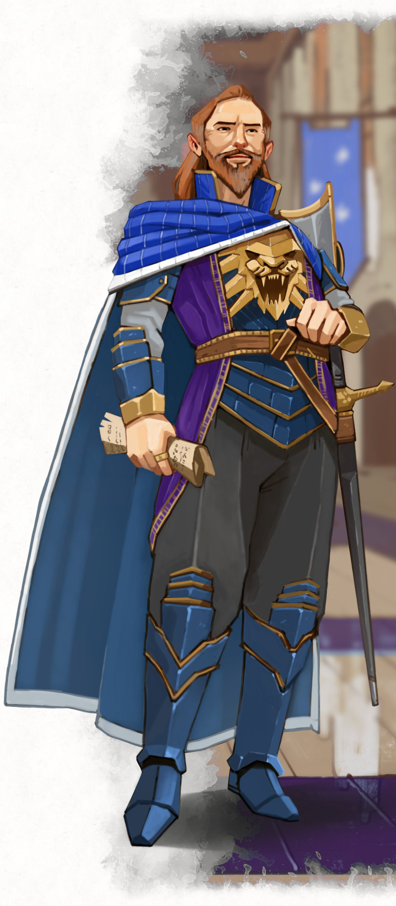

{.image-neverember}

# Lord Protector Neverember

Dagult Neverember, Lord Protector of Neverwinter, is the de facto leader of Neverwinter. He is a complex character that often straddles the edge between altruistic and self-serving. Almost everyone would describe him as ambitious. Lord Neverember has bold plans and, with an intense pragmatism, tends to see those plans through to completion. He is described as confident and charismatic. Those face-to-face with him often find him easily likeable.{.no-fancy}

Born in 1429 DR, Dagult Neverember grew up in Neverwinter with aspirations of forming a mercantile empire from the city. However, he eventually moved to Waterdeep and married the wealthy Alethea Brandarth. They had one son together, Renaer, but Alethea died when Renaer was still young. Alethea left all her wealth to Renaer rather than Dagult. The move left a rift between father and son. Still, Neverember was ultimately able to obtain the high title of Open Lord of Waterdeep by age 50. In this position, he managed to restore the city to much of its former glory after decades of corruption and neglect.

While Neverember was rising to power in Waterdeep, he was also formulating plans for restoring his childhood home of Neverwinter. This would be no easy feat, however, as the city was still in ruins from the eruption of Mount Hotenow. The southeastern quarter of the city had a giant chasm that was spewing out plaguechanged monsters regularly, orcs had invaded the northeastern quarter of the city, and much of the rest of the city was razed. Still, in this destruction, Neverember saw an opportunity. He employed his great wealth and connections to recruit mercenaries to aid him in the task of reclaiming the city.

Neverember's attempts to take control of Neverwinter, however, were met with resistance. Multiple factions, some in the shadows and some public, began to contest Neverember's leadership. There were fights over claims to the throne (as the entire known royal family died in the cataclysm); Neverember claimed himself an heir of former King Nasher Alagondar's bastard son. Neverwinter residents began to express feelings of foreign occupation because of the mercenary forces Neverember hired. While Neverember stretched his resources thin trying to help and control Neverwinter, the Masked Lords of Waterdeep ousted him as Open Lord.

Neverember resented the decision to remove him as Open Lord of Waterdeep, but he was not one to sulk. Instead, this ultimately allowed him to dedicate all of his focus to advancing Neverwinter. This increased focus on Neverwinter, and his prior accomplishments in the city, are quickly improving his standing with the Neverwinter residents. Many of Neverember's former adversaries in the city are losing their will to oppose his rule. Neverember will pay to silently "dispose" of any that claim to be an heir of Alagondar. Neverember moves into a modest villa — a show of humility that resonates well with the populace. Neverember has started efforts to restore Castle Never.