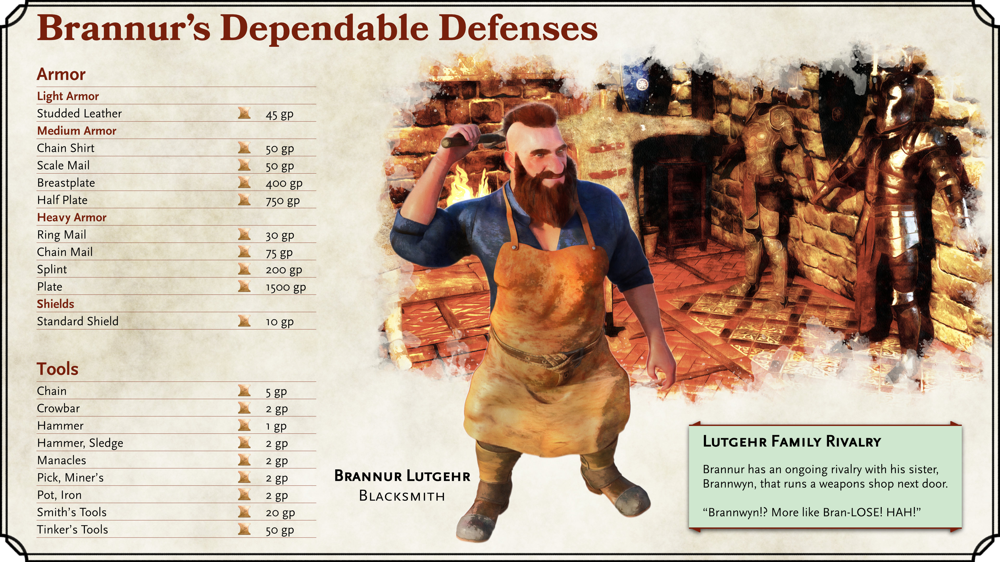
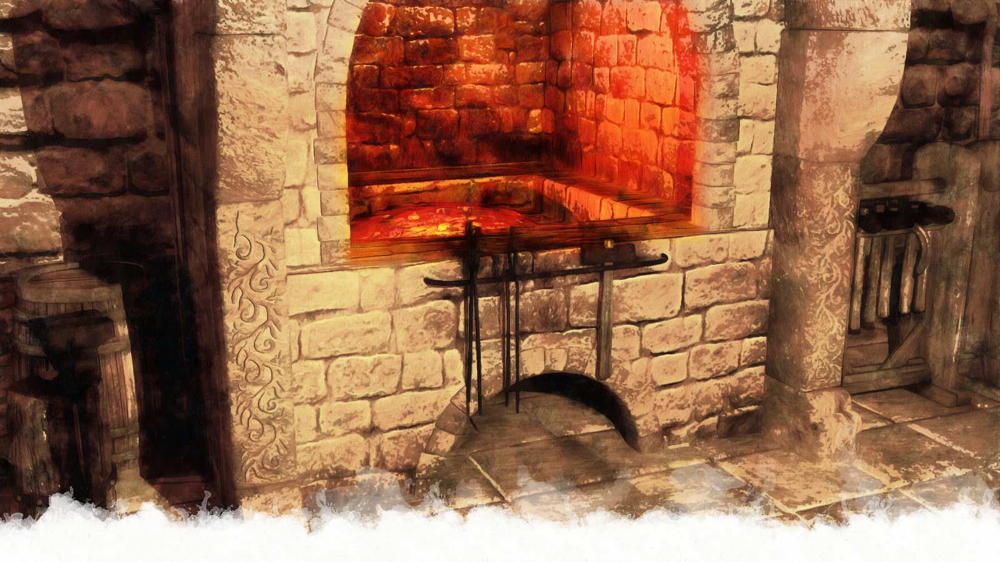
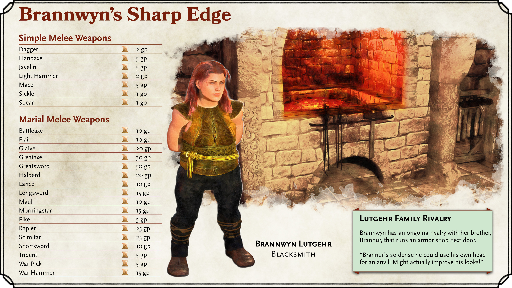
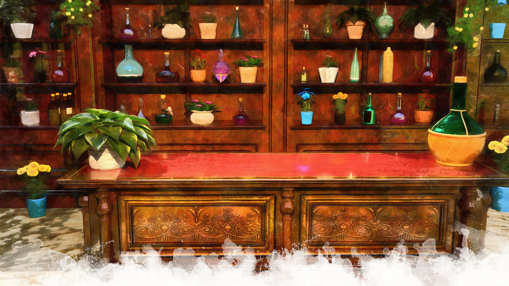
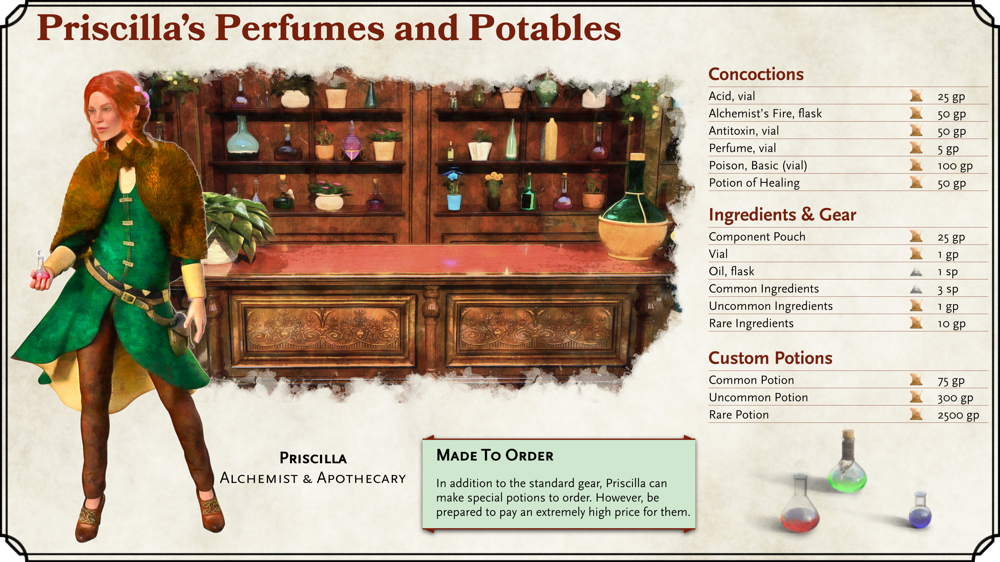
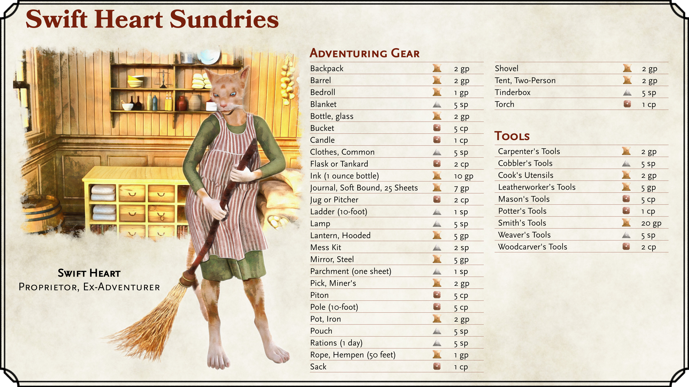
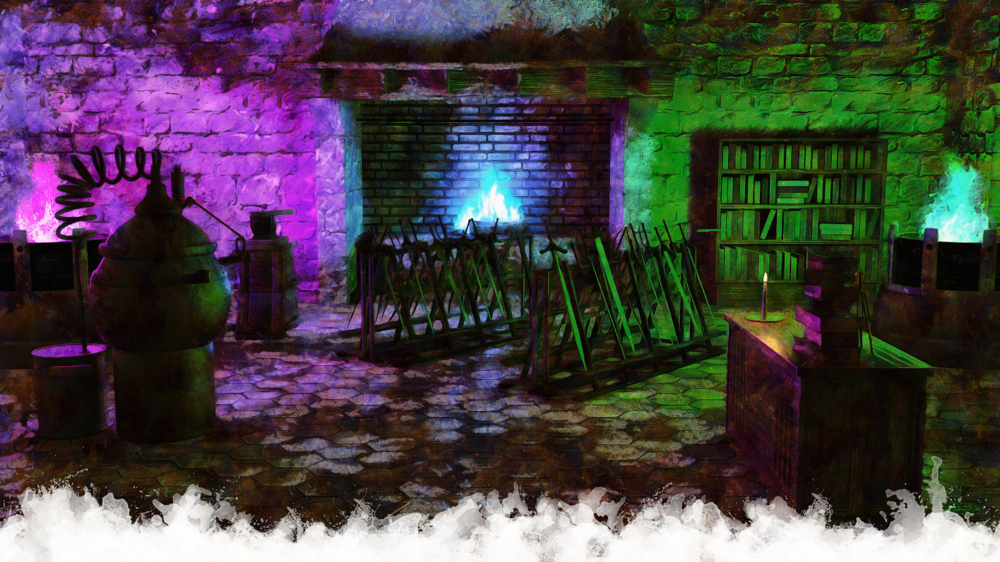
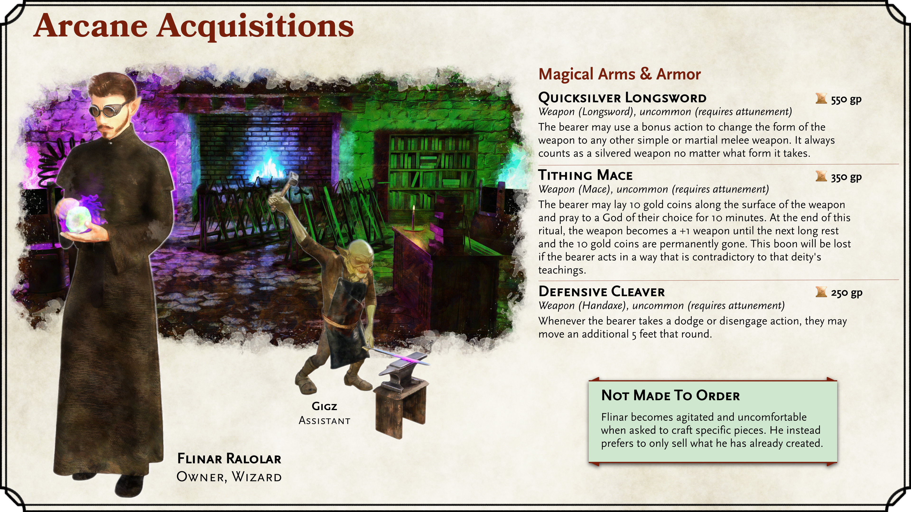

# Homebrew Locations

|**Homebrew Content**|
|---|
|This section is an unofficial Neverwinter location made up for this guide. Customize it for *your* campaign!|
{.homebrew}

Welcome, Dungeon Masters! While the guide has focused on the canonical locations and history of Neverwinter thus far, this section is all about providing newly made-up locations that Dungeon Masters may find useful if running a campaign through this sprawling city. Despite the great locations that are offered up in official lore sources, the city is actually light on more run-of-the-mill, utilitarian shops and locations (at least compared to somewhere like Phandalin).

In this section, you will find an armor shop, a weapons shop, a potions shop, a general goods store, and a magical items shop - all the sorts of things one might expect to find in a larger city in Faerûn. Everything in this section has been made just for this guide, so you should have no worries about changing any of the details about these locations for your campaign should you decide to use them!

Be sure to check out [Appendix B](point-of-interest-cards-page) for useful shop cards that you can hand your players when they visit these locations.

{.size-full .screen-only .before-next-page-header}

### Brannur's Dependable Defenses

Brannur Lutgehr, a talented and hard-working young (by dwarven standards) male dwarf, has seen an opportunity in Neverwinter's reconstruction efforts. Brannur has opened up a blacksmithing shop in Neverwinter's Chasm District to sell armor, tools, and larger pieces of farming equipment (e.g., plows). While the nascent shop is still only positioned to offer the more-standard forms of armor, Brannur is quickly gaining a reputation for well-crafted goods and has even scored some contracts supplying armor to Neverwinter's guard forces.

The shop is impeccably clean and well-organized. Much of the armor on display is polished to a mirror-like finish and always arranged in a perfectly symmetrical configuration on the shop's walls and stands. If Brannur isn't in the back of the shop working with the forges, he can be found in the front of the shop either sweeping or running around with a cloth to remove any smudges that may have found their way onto one of his works. A customer accidentally bumping one of the armor stands such that it skews slightly is likely to give Brannur an involuntary twitch.

Brannur has a calm and polite demeanor, and most of his customers would find it hard to picture him ever raising his voice - be it in excitement or anger. This comes through in his work, as Brannur likes to focus his talents on crafting items of defense and utility rather than items of intended to harm. However, this illusion of a calm stoicism would quickly be dispelled if one were to see Brannur and his sister, Brannwyn, interacting. When those two are in the same room, a heated argument is sure to arise.

|**Dungeon Masters' Inspiration**|
|---|
|***Top Shelf Ingredients***. Brannur wants to take his shop to the next level, but to do so, needs a rare ingredient not easily accessible in this area. He's heard rumor the ingredient was in possession of the pirates at Pirates' Skyhold and would like the party to procure it for him.|
{.dmidea}

{.print-bottom-right .with-margin}

(print-page)

{.print-only .size-cover .no-margin}

{.size-full .screen-only .before-next-page-header}

### Brannwyn's Sharp Edge

Brannwyn Lutgehr, sister of Brannur, also sought out the fortunes that a quickly-evolving Neverwinter may offer. Brannwyn has opened up a shop next door to her brother, Brannur, where she also exhibits her blacksmithing skills by creating all manner of weapons. Like her brother, Brannwyn is also gaining a reputation as being a reliable source to arm Neverwinter's growing defense forces. In fact, some of the city's procurement staff have ired both Brannur and Brannwyn by placing a single order for both armor and weapons, thinking their two shops are a single entity.

Brannwyn's shop lacks the meticulous cleanliness exhibited in her brother's shop, but that doesn't imply the goods are of any lesser quality. The weapons crafted in Brannwyn's shop are forged with care, and they are known to be as reliable as they are deadly. The swords crafted at Brannwyn's shop are sharp, well-balanced, and very sturdy.

Brannwyn's personality is almost the exact opposite of her brother's, and the "Sharp Edge" name of her shop is as likely to be referring to her demeanor as it is to her finely-crafted weapons. Brannwyn is quick-witted and won't hesitate to take a verbal jab at any that arrive in her shop. Those that are easily offended are probably better off shopping elsewhere.

(print-page)

{.print-only .size-cover .no-margin}

> **Sibling Rivalry**
>
> Brannur and Brannwyn are extremely competitive with each other, and each will do almost anything to top the other. Their two shops are immediately next door to each other, which means that such competitions come up often. Some keen shoppers have noticed that they can use this rivalry to their advantage — generally by playing the siblings off each other. All it generally takes is a simple assertion that the other sibling has claimed the ability to do something better than the other; this will cause the first sibling to work extra hard or cut prices simply to one-up the other.  
>
> However, insulting either Brannur or Brannwyn in front of the other sibling will be met with swift fury. At the heart of it, the siblings care deeply for each other, and their petty squabbles are far overshadowed by the immense sense of familial pride and unity. It's quite common to see one of the Lutgehr siblings helping the other by lending a tool or even donating expensive metals and materials. An outsider taking a jab at one of the siblings will, at best, be met with a glare and a return insult and, at worst, get you thrown out of the shop or have the entire Lutgehr clan up in arms.

(print-column)

{.size-full .screen-only .before-next-page-header}

### Priscilla's Perfumes and Potables

Priscilla's Perfumes and Potables is owned and operated by a young human woman who goes simply by "Priscilla" — never a last name given. The beautiful shop, located in the Bluelake District, has floor-to-ceiling shelves filled with fresh flowers and glass bottles of vibrantly colored liquids. In fact, there are so many flowers in this shop that a number of newcomers have mistaken it for a florist. All of the cabinetry in the shop is ornately crafted and polished to a shine.

While the shop's name may seem to indicate that it is focused around perfumes and fragrant beverages, Priscilla is an extremely talented alchemist and apothecary. She is capable of making exotic and rare concoctions for the right price. She also has some talent in diagnosing maladies, though she generally doesn't offer those services unless asked explicitly.

While extremely jovial, Priscilla will avoid giving away much personal information. How she came to possess her skills at such a young age, how she could afford such a nice shop in the Bluelake District, and her family history are all mysterious. Local residents of Bluelake will tell you the shop itself seemed to spring up from nowhere overnight. 

(print-page)

Despite being relatively new to the city, Priscilla is now well known to a large swath of Neverwinter residents as a person with great compassion. She frequently donates her goods and services to poorer Neverwinter residents that are truly in need. She even regularly makes her way down to the Chasm District to hand-deliver potions and poultices to the sick or injured.

All the same, her shop is absolutely befitting of the Bluelake District's desire to be restored to noble estates and households. The more-wealthy residents of Neverwinter all know of Priscilla and frequent her shop for both her potions and finely-crafted fragrances. The poorer residents of Neverwinter may not know of the shop, but will absolutely know of Priscilla herself and her supposed "miracle" cures.

{.size-full .screen-only .before-next-page-header}

### Swift Heart Sundries

Swift Heart Sundries is a general goods store owned by Swift Heart, an older female Tabaxi. The storefront is a modest new building that has was built upon the foundations of a flattened building in the Chasm District. The recently-constructed building smells of fresh wood, fresh flour, and hanging dried herbs. The offerings are humble, but the shop is tidy.

Swift Heart, after a long life filled with treasure-seeking adventures, has used her small collection of wealth to settle down and seek retirement. Always bold, however, Swift Heart intentionally chose to place her shop in an unfamiliar city. She reasoned settling in a strange, new location would at least provide her excitement even in "retirement". Over the course of her travels, she has made numerous connections with suppliers and traders, and surmised she could use these connections to make a profitable little shop. Upon word of the nearly-free land available in Neverwinter's now-sealed chasm, she made haste to the city to establish her store.

Swift Heart now has a relaxed and empathetic disposition, but she will be the first to tell you that she was a passionate adventure-seeker in her youth. She'll gladly tell you a tale or two about her dangerous treks through jungles filled with giant venomous snakes, near-death experiences wandering in endless desert dunes, or even times spent on the high seas with her Tabaxi sea captain friend, Stands in Tar.

{.print-bottom-right .with-margin}

(print-page)

{.print-only .size-cover .no-margin}

{.size-full .screen-only .before-next-page-header}

### Arcane Acquisitions

Arcane Acquisitions is a shop that sells magical arms and armor located in the Chasm district. The shop is generally very easy to locate, as it will generally be emanating a bright purple, green, or blue glow from one of its many forges and braziers (much to the chagrin of its neighbors). Approaching the shop, a customer will generally hear the banging of hammer on anvil, the hiss of steam valves being released from the many stills and alchemical contraptions, or the roar of seemingly-magical flames.

The shop is run by the eccentric half-elf Wizard named Flinar Ralolar. Flinar wears a robe and goggles around his shop, where he quietly toils away with a perpetual frown on his face. His assistant, a goblin by the name of Gigz, performs most of the mundane blacksmithing at the shop. Patrons will never, however, hear Flinar and Gigz conversing as Flinar chooses to telepathically communicate with his assistant.

Flinar Ralolar, age unknown, is a mysterious individual. Not one to volunteer much information, little is known about the wizard. What some do know, however, is that before Flinar arrived in Neverwinter, he was among the many that came to the Wave Echo Cave outside of Phandalin to study the Forge of Spells (once it was cleared of malicious forces by adventurers).

{.print-bottom-right .with-margin}

(print-page)

Flinar isn't unfriendly, per se, just merely very flat in his demeanor. His frown seems to be more of a physical attribute of the man than an actual indication of his discontent. Flinar will even attempt to smile and warmly greet customers that enter his shop, though the expression generally comes across as awkward, insincere, and off-putting. Attempts to converse with Gigz will never result in anything more than a nod or shake of the head.

Flinar offers a variety of magical weapons, armor, and items that he crafts in his workshop. He does not generally take requests or commissions, instead, offering only what he was already created. Some speculate the store is more of a research laboratory for the wizard, and he only chooses to sell his goods to make room for new research.

Use the following table for magical items that might be offered up at Flinar's shop:

|[D12](/roll/d10)| Magic Item                                                                                                                                                                                                                                                                                                                                                                                                                          |
|---|---|
|**1**| **Quicksilver Longsword**   *Weapon (Longsword), uncommon (requires attunement)*  The bearer may use a bonus action to change the form of the weapon to any other simple or martial melee weapon. It always counts as a silvered weapon no matter what form it takes.|
|**2**| **Rain-Activated Chain Mail**   *Armor (Chain Shirt), uncommon (requires attunement)*   This chain mail becomes +1 armor when wetted by rainfall. The chain mail must be wet, and the water must come from rain, otherwise the armor is merely standard chain mail.|
|**3**| **Deerstalker Hat**   *Wondrous Item, uncommon (requires attunement)*   The wearer gains +1 to Investigation checks.|
|**4**| **Tithing Mace**   *Weapon (Mace), uncommon (requires attunement)*  The bearer may lay 10 gold coins along the surface of the weapon and pray to a God of their choice for 10 minutes. At the end of this ritual, the weapon becomes a +1 weapon until the next long rest and the 10 gold coins are permanently gone. This boon will be lost if the bearer acts in a way that is contradictory to that deity's teachings.|
|**5**| **Defensive Cleaver**   *Weapon (Handaxe), uncommon (requires attunement)*   Whenever the bearer takes a dodge or disengage action, they may move an additional 5 feet that round.|
|**6**| **Extra-Light Longbow**   *Weapon (Longbow), uncommon (requires attunement)*   The bearer gain a +1 bonus to initiative rolls.    |
|**7**| **Bartender's Boots**   *Wondrous Item, uncommon (requires attunement)*   The wearer gains +1 charisma when doing Persuasion or Deception checks against any creature to whom they have served a beverage.|
|**8**| **Airy Leather Armor**, *Armor (Leather), uncommon (requires attunement)*   Contains [1d4](/roll/1d4) unreplenishable charges of the Feather Fall spell.|
|**9**| **Enraged Dagger**, *Weapon (Dagger), uncommon (requires attunement)*   Once per day, the bearer may spend their reaction to gain +1 AC and +1 Damage for 30 seconds.|
|**10**| **Babel Earring**   *Wondrous Item, uncommon (requires attunement)*   Contains [1d4](/roll/1d4) unreplenishable charges of the Comprehend Languages spell.|
|**11**| **Shadowgarb Armor**   *Armor (Leather), uncommon (requires attunement)*   From dusk until dawn, the wearer may treat this as +1 armor.|
|**12**| **Ring of Echoes**   *Wondrous Item, rare (requires attunement)*   The bearer may cast Prestidigitation once per day.|
{.allow-breaks}
